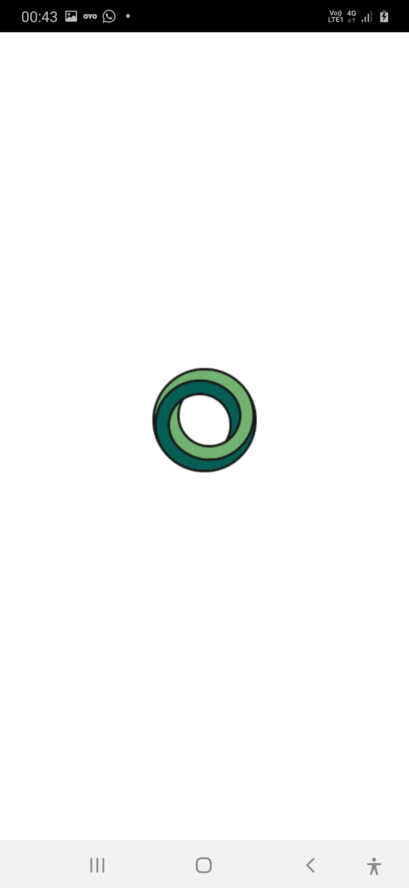
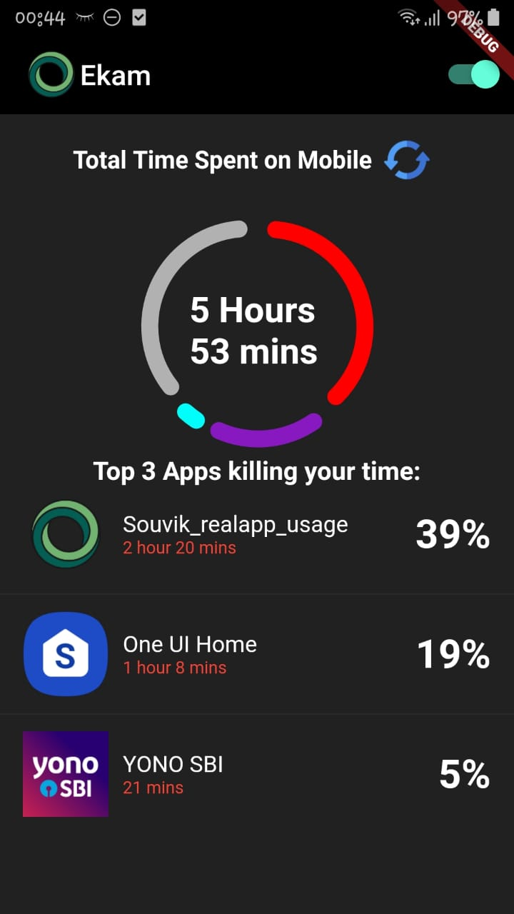
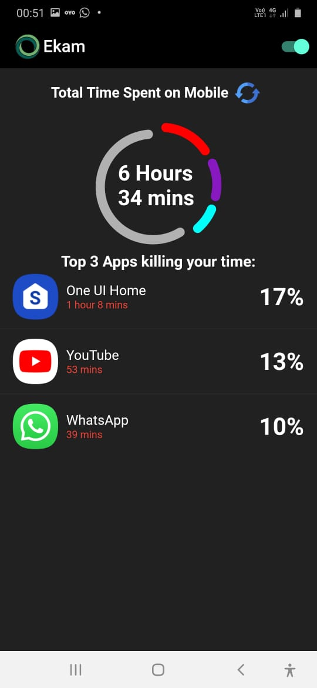
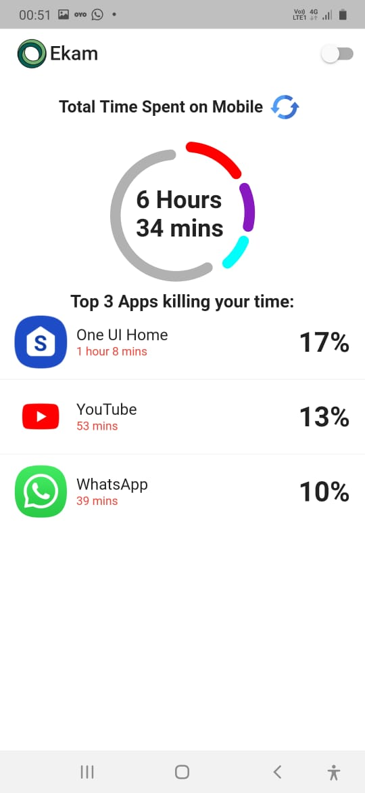

# Real_app_usage
The app shows real apps usage, i.e, the time taken by the installed app in your device,it shows the percentage though a doughnut chart of top three apss's time and rest of apps time taken in the last day, it have both light and dark themes, you can toggle it from the appbar as well as it detects the system default theme

It is linked with Firestore and with each refresh tap the list in firestore document is updated

Allow usage tracking for all the apps for smooth functioning of the app

 &emsp;&emsp;&emsp;&emsp;&emsp;&emsp;&emsp;&emsp;&emsp;&emsp;&emsp; 

 &emsp;&emsp;&emsp;&emsp;&emsp;&emsp;&emsp;&emsp;&emsp;&emsp;&emsp; 

## Getting Started
You can build apps with Flutter using any text editor combined with our command-line tools. However, I recommend using one of Flutter's editor plugins for an even better experience. These plugins provide you with code completion, syntax highlighting, widget editing assists, run & debug support, and more.

## Prerequisites
Things you need to install:
1. Flutter sdk
2. Android Studio/VS Code (IDE)

For more info head towards https://flutter.dev/docs/get-started/install 

## Built With
1. Flutter - The sdk used
2. VS Code - IDE used
3. Android Studio - Android sdk

## Packages used
1. app_usage
2. device_apps
3. provider
4. firebase_core
5. cloud_firestore
6. syncfusion_flutter_charts
7. firebase_database
8. flutter_launcher_icons
9. flutter_native_splash

## Authors
Souvik Banerjee

### Acknowledgments
Thanks to all whose codes were used.
